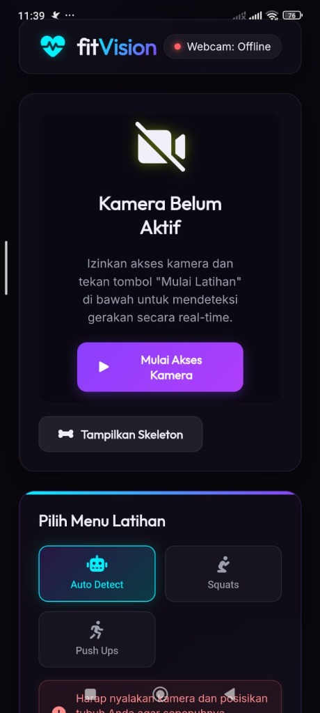
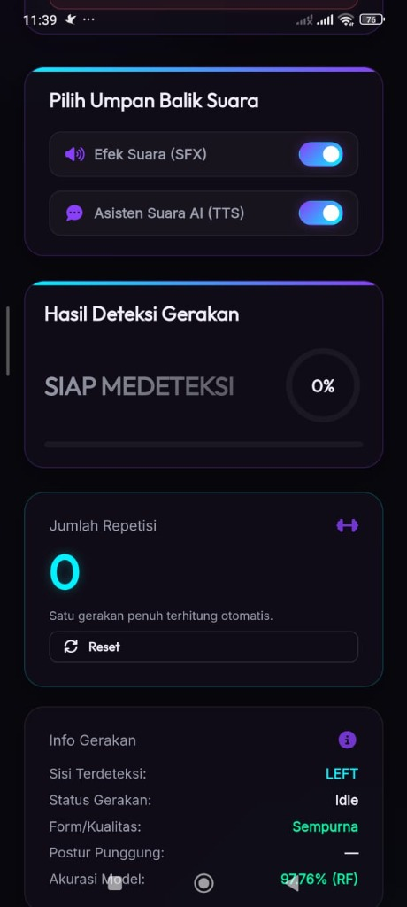

# fitVision - Real-Time AI Exercise Tracker

fitVision (atau fitAI Pro) adalah aplikasi pelacak gerakan olahraga secara real-time yang didukung oleh Kecerdasan Buatan (AI) berbasis penanda tubuh (Pose Landmarks). Aplikasi ini dirancang agar dapat berjalan secara **offline-first** di perangkat Android, menggunakan **MediaPipe Pose** untuk ekstraksi landmark tubuh dan model **Random Forest Classifier** yang diekspor langsung ke JavaScript agar dapat berjalan dengan cepat dan tanpa koneksi internet di WebView.

### 📱 Tampilan Aplikasi
<p align="center">
  
  
</p>

---

## 📁 Struktur Folder Utama

*   `src-tauri/` - Kode Rust dan konfigurasi build Tauri v2 untuk Android.
*   `templates/` - Berisi file UI utama (`index.html`) sebelum diproses untuk build Tauri.
*   `static/` - Berisi aset statis (CSS, Javascript, dan MediaPipe vendor files).
    *   `model_predict.js` - Model klasifikasi Random Forest yang dikonversi dari Python ke JavaScript murni agar dapat berjalan offline di Android.
*   `dist/` - Folder target hasil kompilasi frontend statis sebelum dikemas ke dalam APK oleh Tauri (dibuat otomatis oleh `scripts/build_dist.py`).
*   `scripts/` - Script Python untuk development, build, dan utility.
    *   `build_dist.py` - Script untuk menyalin aset frontend ke folder `dist/` serta menyesuaikan path agar relatif.
    *   `setup_offline.py` - Script untuk menyalin assets/dependencies offline dari `node_modules/` ke `static/vendor/`. Dijalankan otomatis setelah `npm install`.
    *   `export_js.py` - Script untuk mengkonversi model pickle ke JavaScript.
    *   `split_js.py` - Script pembantu untuk membagi file script frontend.
    *   `archive/` - Folder arsip untuk file script deprecated/one-off patch.
*   `ml/` - Folder pipeline Machine Learning.
    *   `train_model.py` - Script training model ML menggunakan dataset.
    *   `exercise_angles.csv` - Dataset sudut gerakan olahraga.
    *   `models/` - Folder penyimpanan file model pickle hasil training (`best_model.pkl`, `scaler.pkl`, `label_encoder.pkl`).
*   `release.keystore` - Kunci keystore yang digunakan untuk menandatangani (signing) paket APK Android agar siap rilis.

---

## 🛠️ Persyaratan Sistem (Prerequisites)

Untuk menjalankan dan membuild aplikasi ini, pastikan sistem Anda memiliki tools berikut:

1.  **Node.js** (v18 ke atas direkomendasikan)
2.  **Rust** (via rustup, diperlukan oleh Tauri)
3.  **Python 3.10+** (untuk development, training model, dan pemrosesan aset)
4.  **Java JDK 17 atau 25** (misalnya `jdk-25.0.2` yang dikonfigurasi pada environment variables)
5.  **Android SDK & NDK** (diperlukan untuk membuild APK Android)

---

## 🚀 Cara Menjalankan & Membuild Aplikasi

### 1. Instalasi Node Dependencies & Offline Setup
Jalankan perintah berikut di root folder untuk menginstall Tauri CLI dan package pendukung. Script `setup_offline.py` akan otomatis terpanggil setelah install selesai untuk menyiapkan asset vendor:
```bash
npm install
```

### 2. Membuild Frontend Statis (`dist/`)
Sebelum Tauri melakukan build, Anda harus memaketkan file HTML, CSS, dan JS ke folder `dist/` menggunakan script Python pembantu:
```bash
npm run build-dist
# atau jalankan manual: python scripts/build_dist.py
```

### 3. Menjalankan Aplikasi dalam Mode Development (Android Emulator / Device)
Pastikan emulator Android Anda sedang aktif atau HP Android Anda terhubung via USB Debugging.
```bash
npm run tauri android dev
```

### 4. Membuild APK Android Akhir (Release)
Untuk membuild paket APK rilis dengan arsitektur target ARM64 (`aarch64`):
```bash
npm run tauri:android
```
Hasil build akhir berupa file APK dapat ditemukan di sub-folder Tauri Android (atau disalin langsung ke root proyek sebagai `fitai-pro-final.apk`).

---

## 🐍 Backend Flask & Machine Learning (Opsional)

Jika Anda ingin menjalankan server Flask lokal untuk development web tradisional, atau ingin melatih ulang model AI menggunakan dataset baru:

### 1. Install Library Python yang Dibutuhkan
```bash
pip install flask scikit-learn pandas joblib m2cgen
```

### 2. Melatih Ulang Model (Training)
Jika Anda memperbarui dataset `ml/exercise_angles.csv`, Anda bisa menjalankan script training berikut:
```bash
python ml/train_model.py
```
Script ini akan menghasilkan file model baru di folder `ml/models/`: `best_model.pkl`, `scaler.pkl`, dan `label_encoder.pkl`.

### 3. Menjalankan Server Flask Lokal
```bash
npm run flask
# atau jalankan manual: python app.py
```
Aplikasi web Flask akan berjalan di `http://127.0.0.1:5000`.

### 4. Mengekspor Model ke JavaScript Offline
Jika Anda melatih model baru dan ingin memasukkannya kembali ke aplikasi offline Android:
```bash
python scripts/export_js.py
```
Script ini akan memperbarui file `static/model_predict.js` berdasarkan file pickle di folder `ml/models/` yang baru dilatih.

---


